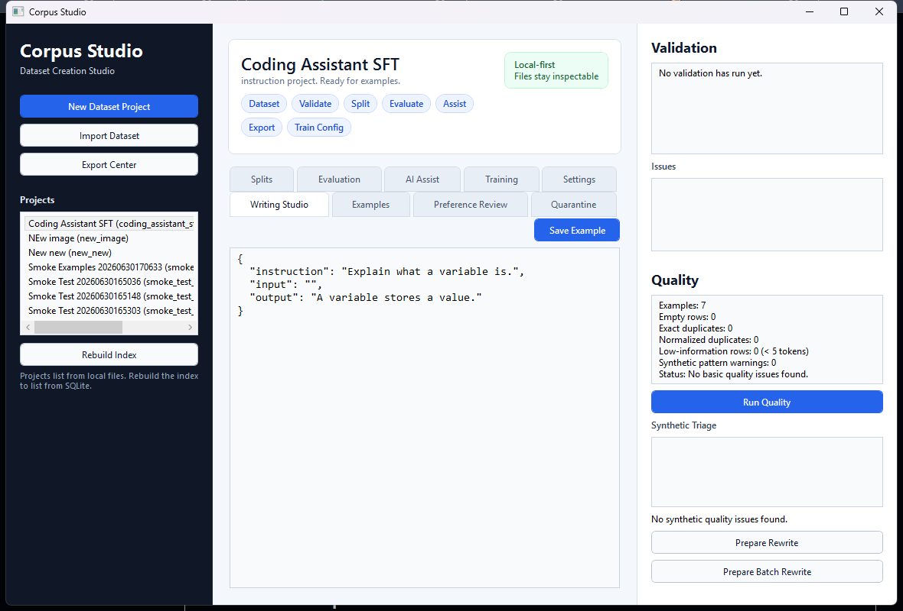

# Corpus Studio

**Corpus Studio** is a local-first dataset creation studio for AI builders.

It is designed to be a one-stop shop for authoring, importing, cleaning, validating, splitting, versioning, and exporting model-ready datasets across multiple schemas:

- raw pretraining corpora
- instruction-tuning datasets
- chat/message datasets
- preference/DPO datasets
- code datasets
- image-caption datasets
- classification datasets
- retrieval/embedding datasets
- evaluation datasets

Corpus Studio is not just a JSONL editor. It is a writing-first dataset IDE
covering the full dataset-to-model workflow: create datasets, validate them,
clean and measure them, test them against local models, export them, generate
training configs, launch your installed trainer with live logs and
checkpoints, and measure the before/after improvement.

## Current Status

Corpus Studio covers the full local loop from authoring to launching a
training run of your own installed trainer:

**Author & validate**
- create projects from built-in schema templates with pre-filled examples
- author and validate examples through the Python engine (required fields,
  types, list element types, enums, numeric bounds, nested object shapes,
  chat message structure) with selectable issue navigation
- preview/import JSONL with failed-row quarantine, review, and retry
- full Unicode support end to end (CJK/Cyrillic/accented text round-trips
  correctly between the desktop and engine)

**Clean & measure**
- quality report: empty rows, exact + normalized duplicates, low-information
  rows, synthetic-pattern warnings with near-duplicate clustering,
  PII/secret detection (emails, SSNs, private keys, AWS/API keys, JWTs,
  Luhn-valid cards — masked samples), token-length outliers, and
  category-imbalance warnings, with project-level quality history
- leakage-checked train/validation/test splits (exact and near-duplicate rows
  shared across splits are reported before they inflate eval scores)
- export with an optional cleaning pass (dedupe / drop low-information) that
  writes a removal manifest; verbatim exports warn when duplicates remain
- preference exports to DPO/KTO/reward with a pair-integrity gate
  (identical/empty/low-contrast pairs reported, `--drop-degenerate` opt-in)
- an inspectable dataset card summarizing metadata, schema, splits, quality,
  and the latest evaluation

**Evaluate**
- Evaluation Lab runs against local Ollama or OpenAI-compatible endpoints with
  health checks, model discovery, report history, two-report comparison,
  regression reruns, tag/failure/score-band summaries, failed-row edit loops,
  manual scoring, and saved failure filters
- multi-model benchmark: run one dataset across several models and rank them,
  with per-model deltas and the examples every model failed
- review-first AI Assist Lab with a persistent accept/reject queue, saved
  views, bulk triage with undo, and resumable rewrite batches

**Train (v0.5 launcher, complete)**
- training config export for axolotl / TRL / Unsloth / Hugging Face /
  LLaMA-Factory with compatibility warnings, a real token budget
  (tokens-per-epoch after truncation, over-length counts), and the exact
  launch command per target
- in-app launch of your installed trainer (explicit confirmation showing the
  exact command, no shell), live log streaming, and a Stop that kills the
  process tree
- checkpoint tracking during and after runs, resume-from-latest for targets
  with a CLI resume flag, and before/after evaluation comparison against the
  baseline captured at launch

Corpus Studio orchestrates your installed trainer — it never bundles CUDA,
PyTorch, or trainer packages, never hides the command it runs, and does not
publish datasets automatically.

## License

MIT. See [`LICENSE`](LICENSE).

## Product principle

Every dataset example should be:

- valid
- inspectable
- traceable
- exportable
- versioned

## Repository Layout

```text
CorpusStudio
├── apps/
│   └── desktop/             # C# WPF desktop app
├── engine/                  # Python dataset engine
├── schemas/                 # Built-in schema definitions
├── docs/                    # Product, architecture, roadmap, workflows
├── examples/                # Example dataset rows
├── scripts/                 # Developer scripts
├── data/                    # Local project data, ignored by git
└── exports/                 # Exported datasets, ignored by git
```

## Desktop preview



## Core Local Loop

Build a local desktop app that supports:

1. project creation
2. built-in schema templates
3. raw text, instruction, chat, and preference datasets
4. example authoring
5. schema validation
6. quality checks
7. train/validation/test split generation
8. JSONL export

## Development notes

The recommended stack is:

- C# WPF / WinUI-style desktop front-end
- Python dataset engine
- file-backed project state, with an optional SQLite index for fast project listing
- JSONL as the first export target
- Pydantic for schema validation
- Polars / DuckDB later for large datasets when needed

Tests: the Python engine has a pytest suite (with opt-in local Ollama
integration tests), and the desktop app has xUnit tests over its persistence
layer. Both run in CI (`.github/workflows/engine-tests.yml` and
`.github/workflows/desktop-tests.yml`).

See [`docs/PRODUCT_SPEC.md`](docs/PRODUCT_SPEC.md) and [`docs/ARCHITECTURE.md`](docs/ARCHITECTURE.md).

For hands-on setup, see [`docs/DEVELOPMENT_SETUP.md`](docs/DEVELOPMENT_SETUP.md).
For copyable row formats, see [`docs/SCHEMA_EXAMPLES.md`](docs/SCHEMA_EXAMPLES.md).
For dataset card output, see [`docs/DATASET_CARD.md`](docs/DATASET_CARD.md).
For the staged labs, see [`docs/EVALUATION_LAB.md`](docs/EVALUATION_LAB.md),
[`docs/AI_ASSIST_LAB.md`](docs/AI_ASSIST_LAB.md), and
[`docs/TRAINING_LAB.md`](docs/TRAINING_LAB.md).
For the training launcher architecture, see
[`docs/TRAINING_LAUNCHER_DESIGN.md`](docs/TRAINING_LAUNCHER_DESIGN.md).
For public-release hygiene and known non-features, see
[`docs/RELEASE_CHECKLIST.md`](docs/RELEASE_CHECKLIST.md).
