# Corpus Studio

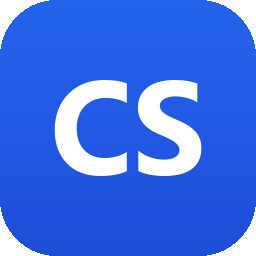

[](https://codecov.io/gh/MalloyTheDev/CorpusStudio)

**Corpus Studio** is a local-first dataset creation studio for AI builders.

It is designed to be a one-stop shop for authoring, importing, cleaning, validating, splitting, versioning, and exporting model-ready datasets across multiple schemas:

- raw pretraining corpora
- instruction-tuning datasets
- chat/message datasets
- preference/DPO datasets
- code datasets
- image-caption datasets
- classification datasets
- retrieval/embedding datasets
- evaluation datasets

Corpus Studio is not just a JSONL editor. It is a writing-first dataset IDE
covering the full dataset-to-model workflow: create datasets, validate them,
clean and measure them, grade their outstanding debt, run pass/warn/block gates,
generate or rewrite candidates only with policy-approved providers under human
review, test and compare models, export them, version/diff/restore the dataset,
generate training configs, run the QLoRA yourself (the opt-in first-party trainer)
or launch your own installed trainer with live logs and checkpoints, track every
run and the model artifacts it produces, and measure the before/after improvement.

The single source of truth for what is implemented today is
[`docs/CURRENT_STATE.md`](docs/CURRENT_STATE.md).

## Current Status

Corpus Studio covers the full local loop from authoring, through governed
cleaning and gating, evaluation and model comparison, to launching and tracking
a training run — its own opt-in first-party trainer, or your installed trainer:

**Author & validate**
- create projects from built-in schema templates with pre-filled examples
- author and validate examples through the Python engine (required fields,
  types, list element types, enums, numeric bounds, nested object shapes,
  chat message structure) with selectable issue navigation
- preview/import JSONL, CSV, and TSV with failed-row quarantine, review, and retry
- full Unicode support end to end (CJK/Cyrillic/accented text round-trips
  correctly between the desktop and engine)

**Clean & measure**
- quality report: empty rows, exact + normalized duplicates, low-information
  rows, synthetic-pattern warnings with near-duplicate clustering,
  PII/secret detection (emails, SSNs, private keys, AWS/API keys, JWTs,
  Luhn-valid cards — masked samples), token-length outliers, and
  category-imbalance warnings, with project-level quality history
- leakage-checked train/validation/test splits (exact and near-duplicate rows
  shared across splits are reported before they inflate eval scores)
- export with an optional cleaning pass (dedupe / drop low-information) that
  writes a removal manifest; verbatim exports warn when duplicates remain
- export as JSONL (default, model-ready) or CSV/TSV for flat schemas (a
  chat/nested-object schema is refused rather than lossy-flattened)
- preference exports to DPO/KTO/reward with a pair-integrity gate
  (identical/empty/low-contrast pairs reported, `--drop-degenerate` opt-in)
- an inspectable dataset card summarizing metadata, schema, splits, quality,
  and the latest evaluation
- a graded **dataset debt** ledger: the quality signals normalized by dataset
  size, ranked by severity, and graded A–F so you know what to fix first
  (secrets/PII are graded by presence — a single leaked key is critical), each
  with a concrete remediation, surfaced in a desktop Debt tab whose grade
  invalidates the moment the dataset changes. See [`docs/DEBT.md`](docs/DEBT.md)

**Version & restore**
- durable dataset version history: capture the dataset's identity at a moment in
  time (a streaming content fingerprint + row count) with pinned links to the
  runs, artifacts, and evaluations from that state; live drift detection reports
  whether the current dataset still matches a version (matches / drifted /
  unreadable), and a live version card renders the lineage
- compare two versions (added / removed / common rows) and **restore** a
  version's exact rows. In the desktop, an in-place restore captures the current
  dataset as an undo point first, atomically swaps in the restored rows, and
  refuses if a safe undo could not be captured. The engine never writes
  `examples.jsonl` — the desktop is the single writer. See
  [`docs/VERSIONING.md`](docs/VERSIONING.md)

**Govern & gate**
- role-based provider policy enforced **in the engine** (not just the UI):
  OpenAI/Anthropic are evaluator-only by default; local models (Ollama, local
  OpenAI-compatible servers) may generate trainable rows only when explicitly
  approved; OpenRouter is route-aware. Surfaced in a Settings panel. See
  [`docs/PROVIDER_POLICY.md`](docs/PROVIDER_POLICY.md)
- a gate runner producing serializable pass/warn/block reports over the
  existing schema, quality, leakage, and PII/secret logic; the export gate
  blocks on schema/PII failures. Surfaced by a Run Gates button. See
  [`docs/GATES.md`](docs/GATES.md)
- chat conversation-structure gate for chat datasets (`chat-gate`, plus a
  Run Chat Gates button): flags assistant-first, missing/dangling turns,
  back-to-back roles, misplaced system messages, turn-count bounds, and empty
  turns — advisory by default, escalatable to a block

**Evaluate & compare**
- Evaluation Lab runs against local Ollama or OpenAI-compatible endpoints with
  health checks, model discovery, report history, two-report comparison,
  regression reruns, tag/failure/score-band summaries, failed-row edit loops,
  manual scoring, and saved failure filters. The default automatic score is
  **keyword-overlap** recall — a lexical proxy, *not* a quality judgment; for a
  real quality signal use the opt-in **LLM-judge** scorer (`eval-run --judge-model`,
  also selectable per suite case) or manual scoring
- multi-model benchmark: run one dataset across several models and rank them,
  with per-model deltas and the examples every model failed
- Model Arena: run a prompt suite across several models side by side, with an
  optional evaluator-only judge that scores responses and picks a winner, and
  saved comparison reports
- Evaluation Suites: named, reusable multi-case suites (dataset × model × metric)
  with a per-metric verdict and optional dataset-`version_id`-pinned cases, run from
  the `suite-*` CLI or the desktop Suites tab. See
  [`docs/EVALUATION_SUITES.md`](docs/EVALUATION_SUITES.md)
- review-first AI Assist Lab with a persistent accept/reject queue, saved
  views, bulk triage with undo, and resumable rewrite batches — every AI
  suggestion is review-required and never auto-accepted. AI-generated candidate
  rows are run through the dataset gate runner (schema/quality/PII) before review
  and carry a `candidate_gate` verdict — a pre-review signal only: a clean gate is
  not approval, a block does not auto-reject, and provider policy is enforced
  before generation

**Train & track**
- training config export for the first-party `corpus_studio` trainer or axolotl /
  TRL / Unsloth / Hugging Face / LLaMA-Factory, with compatibility warnings, a real
  token budget (tokens-per-epoch after truncation, over-length counts), a rough VRAM
  planning estimate, a LoRA rank/alpha suggestion, and the exact launch command
- an **opt-in first-party QLoRA trainer** (the `[train]` extra): `train-check`
  preflights the runtime, `train-run` runs a 4-bit QLoRA in-process and writes the
  adapter + a model card, `train-merge` merges it back (with a small-VRAM fallback),
  and `model-fetch` reliably downloads a permissive base model with its license
- in-app launch of the first-party trainer or your installed trainer (explicit
  confirmation showing the exact command, no shell), live log streaming, and a Stop
  that kills the process tree
- checkpoint tracking during and after runs, resume-from-latest for targets
  with a CLI resume flag, and before/after evaluation comparison against the
  baseline captured at launch
- a durable training run registry: every run is recorded (argv, config, output
  dir, status, pid, checkpoints, before-eval link) under `training_runs/`, a
  force-closed run reconciles to `interrupted` on load, and a read-only run
  history browses past runs
- a durable model artifact registry: the adapters/checkpoints a run produced are
  tracked by referenced path (never moved), with path-integrity re-checked on
  load (`modified`/`missing` if the weights change on disk), a live weight card,
  and a promote gate that refuses to keep a modified/missing or regressed
  artifact

Corpus Studio's dependency-light core never bundles CUDA, PyTorch, or trainer
packages — training deps are opt-in via the `[train]` extra, which adds the
first-party trainer; you can also launch your own installed trainer. It never
hides the command it runs, enforces who may generate trainable data, and does not
publish datasets or auto-accept generated rows.

## License

MIT. See [`LICENSE`](LICENSE).

## Product principle

Every dataset example should be:

- valid
- inspectable
- traceable
- exportable
- versioned

## Repository Layout

```text
CorpusStudio
├── apps/
│   └── desktop/             # C# WPF desktop app
├── engine/                  # Python dataset engine
├── schemas/                 # Built-in schema definitions
├── docs/                    # Product, architecture, roadmap, workflows
├── examples/                # Example dataset rows
├── scripts/                 # Developer scripts
├── data/                    # Local project data, ignored by git
└── exports/                 # Exported datasets, ignored by git
```

## Desktop preview

A walk through the workspace, front to back. An IDE-style activity bar toggles
between the **Start Center**, the file **Explorer**, and the **Studio**, with
**Problems** and **Output** panels docked at the bottom. See
[`docs/WORKSPACE_SYSTEM.md`](docs/WORKSPACE_SYSTEM.md).

The cross-platform (Avalonia) shell has been re-skinned to the **Nocturne** design
system — a quiet, compact, dark-first look with a grouped workflow-phase sidebar
(**Overview · Author · Measure · Evaluate · Train**) in place of a flat tab strip,
Phosphor iconography throughout, and a contextual quality rail. The tokens, icon
set, and screen inventory are the framework-agnostic source of truth in
[`docs/design/`](docs/design/), so the same design carries toward the eventual
Tauri/React shell. The full workflow — Start Center → New Project wizard →
Explorer → Studio — is shown below on that Nocturne shell.

### Nocturne desktop

The Studio, screen by screen, on the cross-platform shell. Every surface renders
**live engine data** — grades, quality metrics, split ratios, integrity verdicts —
and where a signal doesn't exist it reads neutral rather than inventing one.

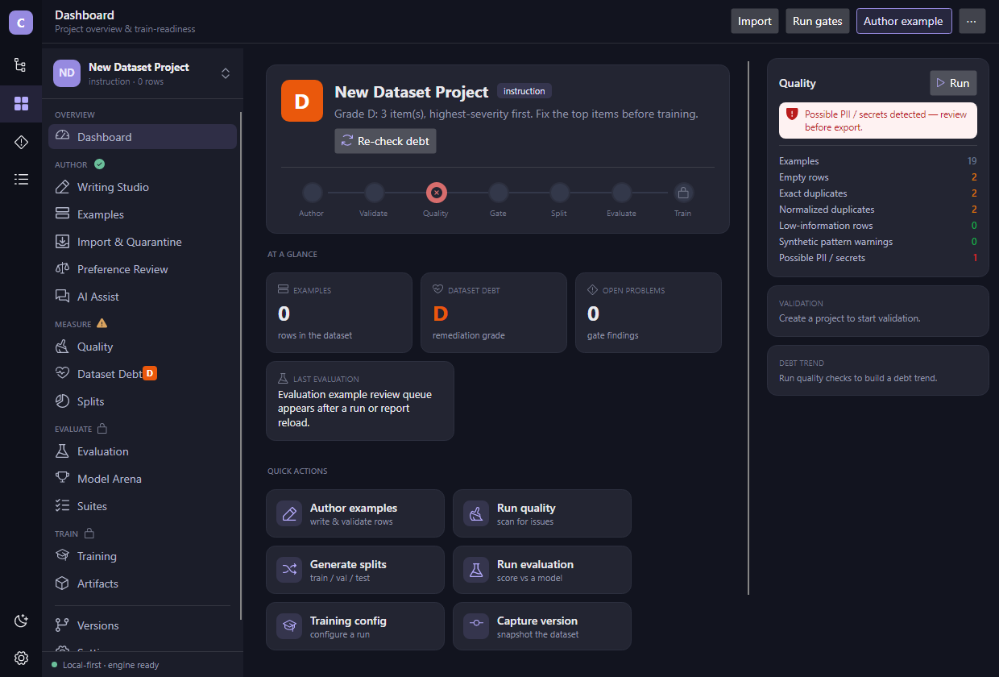

**Dashboard** — a readiness hero (the dataset-debt grade badge over a 7-node
lifecycle strip whose per-node status is derived from real view-model signals and
stays neutral where a signal doesn't exist), stat cards, quick actions, a RECENT
ACTIVITY feed bound to the real engine-operation log, and the contextual Quality rail.

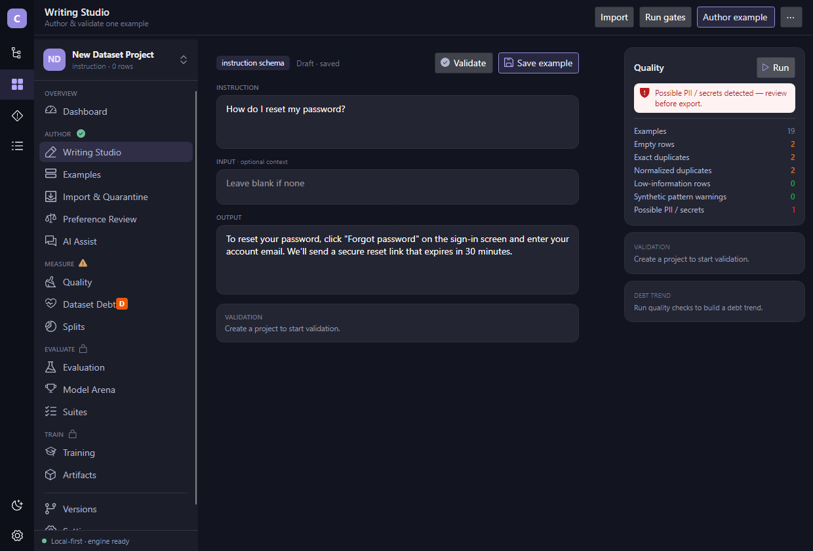

**Writing Studio** — a structured Instruction / Input / Output authoring form (a
live projection of the underlying JSON, so validation and save are unchanged), with
the schema pill, Validate / Save actions, and an honest validation card.

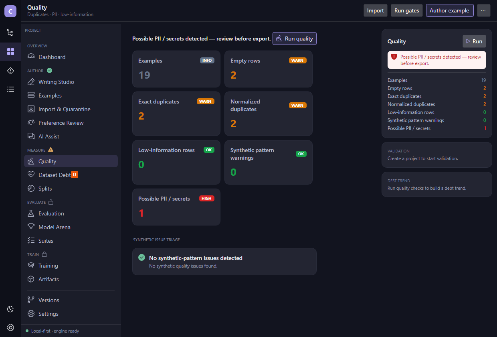

**Quality** — a metric-card grid (empty rows, exact/near duplicates, PII/secrets,
low-information, synthetic patterns) with severity pills, plus synthetic-issue
triage; severities are advisory and never silently block export.

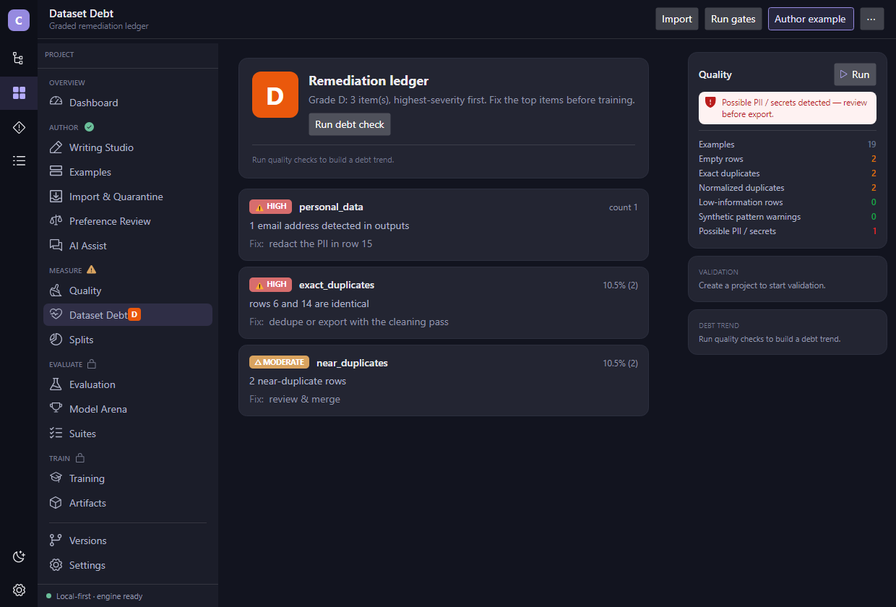

**Dataset Debt** — a grade hero with a verdict headline (derived honestly from the
grade) and a mini bar-chart of the real quality-issue trend, over a severity-ranked
remediation ledger; the rail's PII banner and validation card reflect real state.

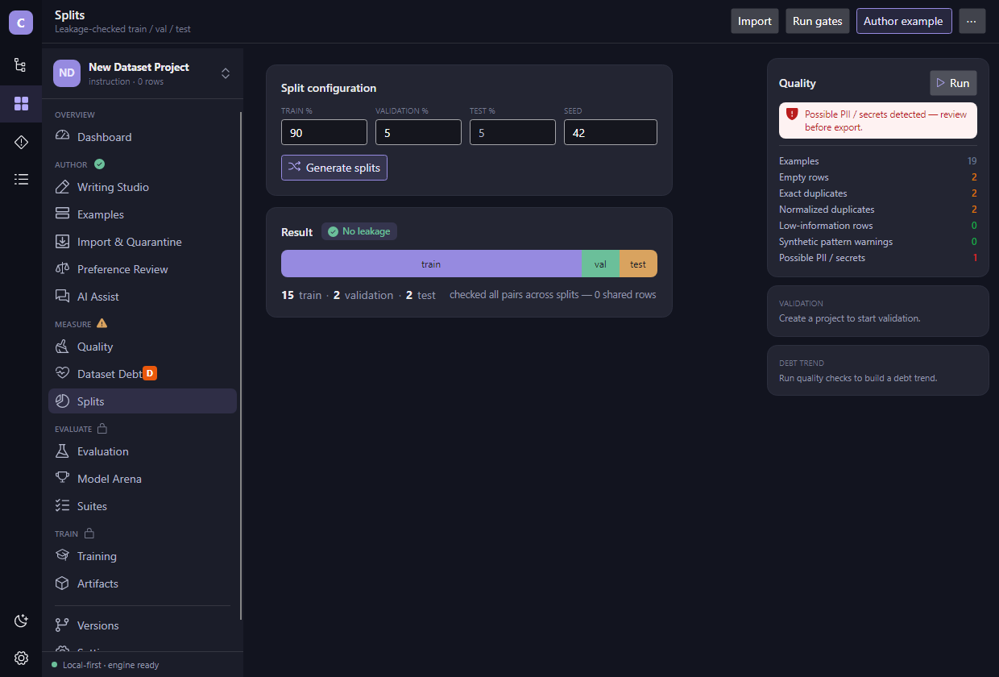

**Splits** — leakage-checked train / val / test with a proportion bar sized by the
real ratios, a "No leakage" chip driven by the real shared-row count, and a counts
footer — no fabricated proportions.

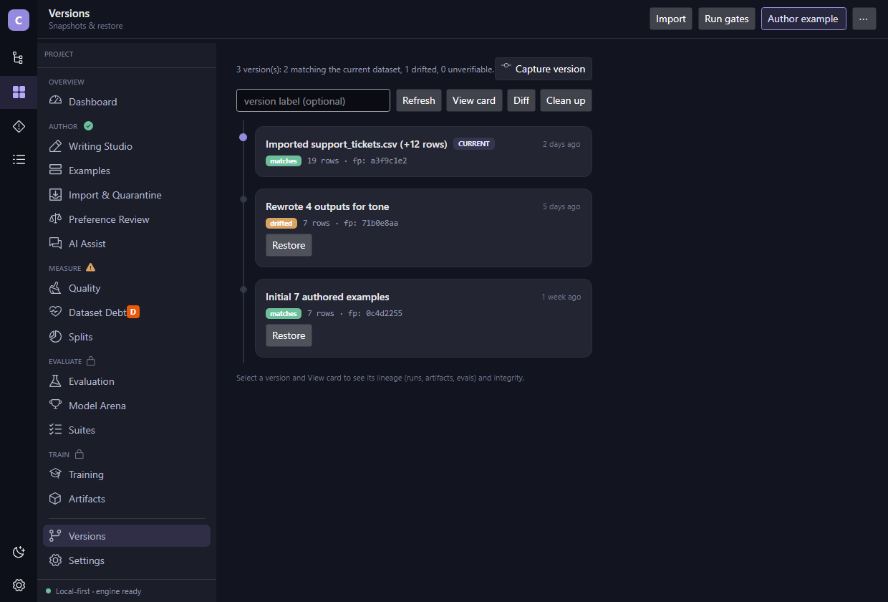

**Versions** — a single-writer-safe snapshot timeline: the head is marked
**CURRENT**, older snapshots restore in place, and each card shows the real row
count + content fingerprint (no per-version grade is invented).

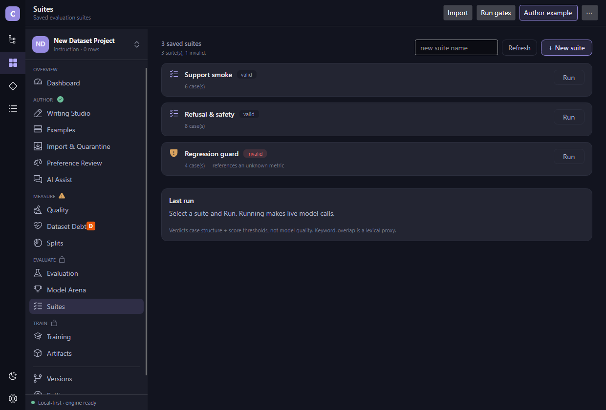

**Suites** — saved evaluation suites as self-contained cards with a per-kind glyph,
a valid/invalid badge from the real registry state, and a per-card Run — omitting
the metric/score tokens the engine payload doesn't carry rather than faking them.

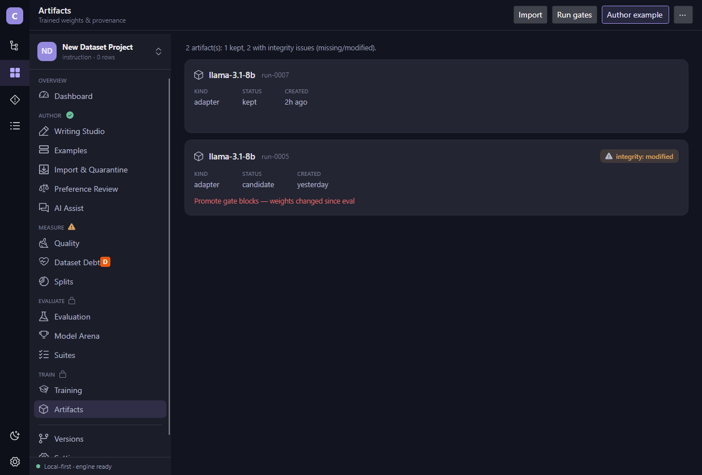

**Artifacts** — trained weights as provenance cards with a real integrity chip
(present / modified) and, when a run's weights changed since eval, the actual
promote-gate block message — the honesty invariant, surfaced.

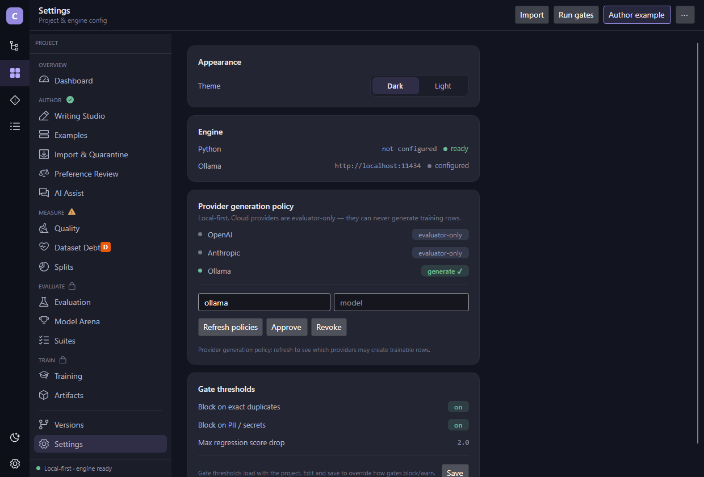

**Settings** — appearance, engine status, gate thresholds, and the **fail-closed
provider policy** (cloud providers are evaluator-only; only the local backend may
generate training rows) shown truthfully rather than as an editable free-for-all.

### Workspace features

The Studio also lives inside an IDE-style workspace — a Start Center, a
scaffolding wizard, and a universal file explorer (see
[`docs/WORKSPACE_SYSTEM.md`](docs/WORKSPACE_SYSTEM.md)).

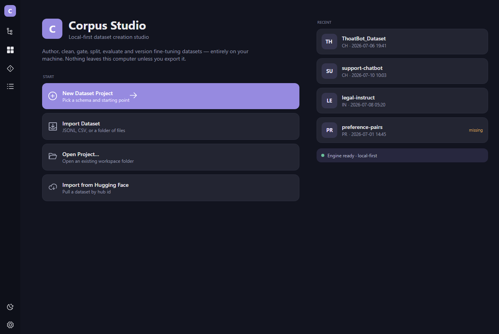

**Start Center** — a dataset is a workspace, not just rows. Start a new project,
import a dataset, open an existing folder (Corpus Studio never mutates your files
without asking), or jump back into a recent workspace. Missing folders are flagged
"missing", never silently dropped, and the engine-status card reads live.

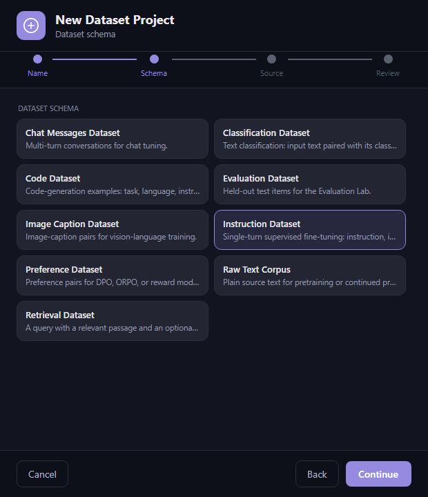

**New Project wizard** — a four-step flow (**Name · Schema · Source · Review**):
name the project, pick a dataset schema from the built-in set, choose a starting
point (scaffold template), then review a live preview of the exact folder structure
before anything is written to disk.

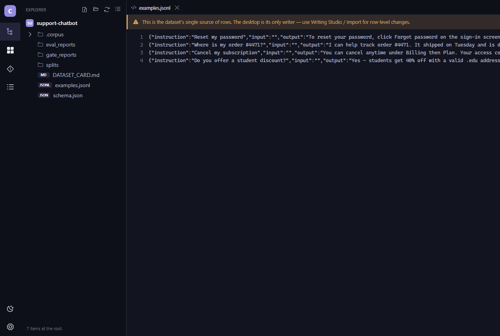

**Universal Workspace Explorer** — a VS Code-style file tree with file-type chips
and a marker on generated artifacts, document tabs, and a read-only code viewer with
a line-number gutter. `examples.jsonl` opens with a single-writer caution banner and
is never mutated except by an explicit save.

## Core Local Loop

Build a local desktop app that supports:

1. project creation
2. built-in schema templates
3. raw text, instruction, chat, and preference datasets
4. example authoring
5. schema validation
6. quality checks
7. train/validation/test split generation
8. JSONL export

## Development notes

The recommended stack is:

- C# WPF / WinUI-style desktop front-end
- Python dataset engine
- file-backed project state, with an optional SQLite index for fast project listing
- JSONL as the first export target
- Pydantic for schema validation
- Polars / DuckDB later for large datasets when needed

Tests: the Python engine has a pytest suite (with opt-in local Ollama
integration tests), and the desktop app has xUnit tests over its persistence
layer. Both run in CI (`.github/workflows/engine-tests.yml` and
`.github/workflows/desktop-tests.yml`).

For what is implemented today, see [`docs/CURRENT_STATE.md`](docs/CURRENT_STATE.md)
(the source of truth). For the product vision and staged roadmap, see
[`docs/PRODUCT_SPEC.md`](docs/PRODUCT_SPEC.md), [`docs/ROADMAP.md`](docs/ROADMAP.md),
and [`docs/ARCHITECTURE.md`](docs/ARCHITECTURE.md).

For hands-on setup, see [`docs/DEVELOPMENT_SETUP.md`](docs/DEVELOPMENT_SETUP.md).
For every engine command (the desktop shells out to the same ones), see the
[`docs/CLI_REFERENCE.md`](docs/CLI_REFERENCE.md).
For copyable row formats, see [`docs/SCHEMA_SYSTEM.md`](docs/SCHEMA_SYSTEM.md) and
the per-schema reference in [`docs/schemas/`](docs/schemas/README.md).
For dataset card output, see [`docs/DATASET_CARD.md`](docs/DATASET_CARD.md).
For provider generation policy and gates, see
[`docs/PROVIDER_POLICY.md`](docs/PROVIDER_POLICY.md) and
[`docs/GATES.md`](docs/GATES.md).
For dataset version history (capture/diff/restore) and the debt ledger, see
[`docs/VERSIONING.md`](docs/VERSIONING.md) and [`docs/DEBT.md`](docs/DEBT.md).
For the staged labs, see [`docs/EVALUATION_LAB.md`](docs/EVALUATION_LAB.md),
[`docs/AI_ASSIST_LAB.md`](docs/AI_ASSIST_LAB.md), and
[`docs/TRAINING.md`](docs/TRAINING.md) (config export, launcher architecture,
run tracking).
For dataset task walkthroughs, see [`docs/WORKFLOWS.md`](docs/WORKFLOWS.md).
For public-release hygiene and known non-features, see
[`docs/RELEASE_CHECKLIST.md`](docs/RELEASE_CHECKLIST.md).
