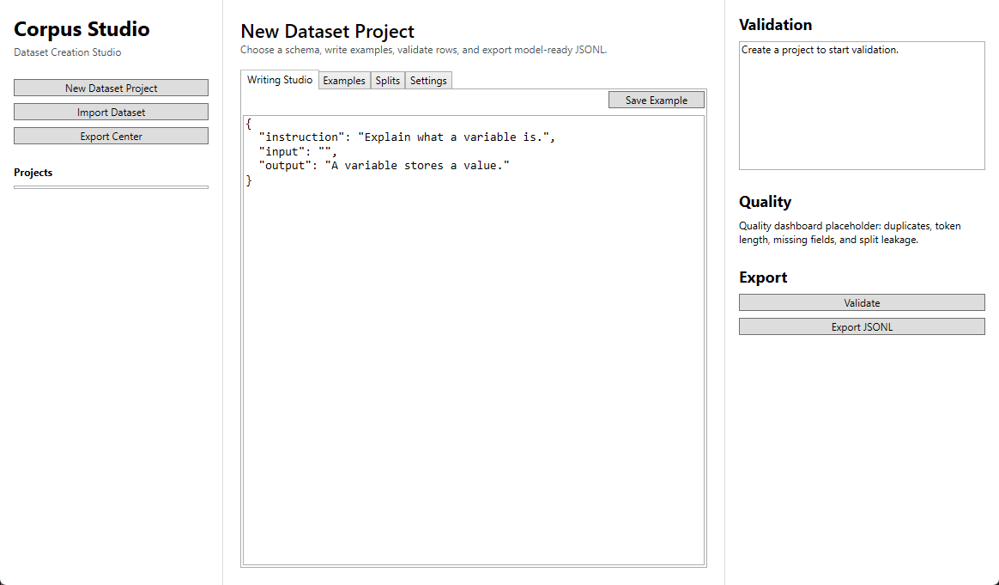

# Corpus Studio

**Corpus Studio** is a local-first dataset creation studio for AI builders.

It is designed to be a one-stop shop for authoring, importing, cleaning, validating, splitting, versioning, and exporting model-ready datasets across multiple schemas:

- raw pretraining corpora
- instruction-tuning datasets
- chat/message datasets
- preference/DPO datasets
- code datasets
- image-caption datasets
- classification datasets
- retrieval/embedding datasets
- evaluation datasets

Corpus Studio is not just a JSONL editor. It is a writing-first dataset IDE.

## Status

Corpus Studio now has a working v0.1 local loop:

- create a dataset project from the WPF desktop app
- choose a built-in schema
- author a JSON example
- validate it through the Python engine
- save it to the local project
- run basic quality checks
- generate train/validation/test split files
- export validated JSONL

## License

MIT. See [`LICENSE`](LICENSE).

## Product principle

Every dataset example should be:

- valid
- inspectable
- traceable
- exportable
- versioned

## Planned architecture

```text
CorpusStudio
├── apps/
│   └── desktop/             # C# WPF desktop app
├── engine/                  # Python dataset engine
├── schemas/                 # Built-in schema definitions
├── docs/                    # Product, architecture, roadmap, workflows
├── examples/                # Example dataset rows
├── scripts/                 # Developer scripts
├── data/                    # Local project data, ignored by git
└── exports/                 # Exported datasets, ignored by git
```

## Desktop preview



## v0.1 goal

Build a local desktop app that supports:

1. project creation
2. built-in schema templates
3. raw text, instruction, chat, and preference datasets
4. example authoring
5. schema validation
6. basic quality checks
7. train/validation/test split generation
8. JSONL export

## Development notes

The recommended stack is:

- C# WPF / WinUI-style desktop front-end
- Python dataset engine
- SQLite for local project state
- JSONL as the first export target
- Pydantic for schema validation
- Polars / DuckDB later for large datasets

See [`docs/PRODUCT_SPEC.md`](docs/PRODUCT_SPEC.md) and [`docs/ARCHITECTURE.md`](docs/ARCHITECTURE.md).

For hands-on setup, see [`docs/DEVELOPMENT_SETUP.md`](docs/DEVELOPMENT_SETUP.md).
For copyable row formats, see [`docs/SCHEMA_EXAMPLES.md`](docs/SCHEMA_EXAMPLES.md).
