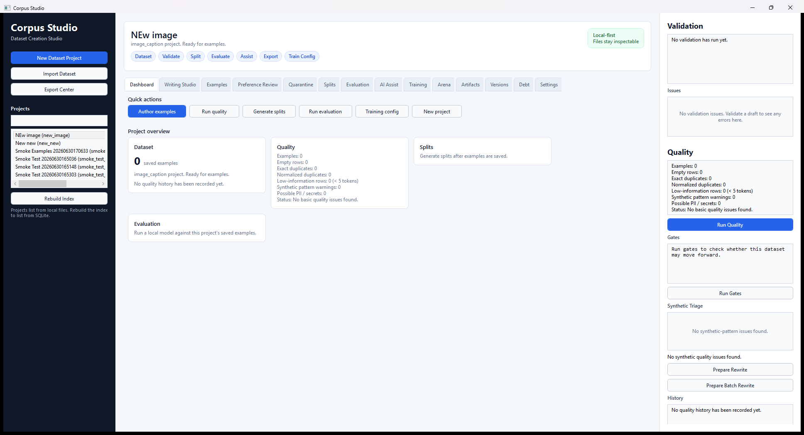

# Corpus Studio

**Corpus Studio** is a local-first dataset creation studio for AI builders.

It is designed to be a one-stop shop for authoring, importing, cleaning, validating, splitting, versioning, and exporting model-ready datasets across multiple schemas:

- raw pretraining corpora
- instruction-tuning datasets
- chat/message datasets
- preference/DPO datasets
- code datasets
- image-caption datasets
- classification datasets
- retrieval/embedding datasets
- evaluation datasets

Corpus Studio is not just a JSONL editor. It is a writing-first dataset IDE
covering the full dataset-to-model workflow: create datasets, validate them,
clean and measure them, grade their outstanding debt, run pass/warn/block gates,
generate or rewrite candidates only with policy-approved providers under human
review, test and compare models, export them, version/diff/restore the dataset,
generate training configs, launch your installed trainer with live logs and
checkpoints, track every run and the model artifacts it produces, and measure the
before/after improvement.

The single source of truth for what is implemented today is
[`docs/CURRENT_STATE.md`](docs/CURRENT_STATE.md).

## Current Status

Corpus Studio covers the full local loop from authoring, through governed
cleaning and gating, evaluation and model comparison, to launching and tracking
a training run of your own installed trainer:

**Author & validate**
- create projects from built-in schema templates with pre-filled examples
- author and validate examples through the Python engine (required fields,
  types, list element types, enums, numeric bounds, nested object shapes,
  chat message structure) with selectable issue navigation
- preview/import JSONL with failed-row quarantine, review, and retry
- full Unicode support end to end (CJK/Cyrillic/accented text round-trips
  correctly between the desktop and engine)

**Clean & measure**
- quality report: empty rows, exact + normalized duplicates, low-information
  rows, synthetic-pattern warnings with near-duplicate clustering,
  PII/secret detection (emails, SSNs, private keys, AWS/API keys, JWTs,
  Luhn-valid cards — masked samples), token-length outliers, and
  category-imbalance warnings, with project-level quality history
- leakage-checked train/validation/test splits (exact and near-duplicate rows
  shared across splits are reported before they inflate eval scores)
- export with an optional cleaning pass (dedupe / drop low-information) that
  writes a removal manifest; verbatim exports warn when duplicates remain
- preference exports to DPO/KTO/reward with a pair-integrity gate
  (identical/empty/low-contrast pairs reported, `--drop-degenerate` opt-in)
- an inspectable dataset card summarizing metadata, schema, splits, quality,
  and the latest evaluation
- a graded **dataset debt** ledger: the quality signals normalized by dataset
  size, ranked by severity, and graded A–F so you know what to fix first
  (secrets/PII are graded by presence — a single leaked key is critical), each
  with a concrete remediation, surfaced in a desktop Debt tab whose grade
  invalidates the moment the dataset changes. See [`docs/DEBT.md`](docs/DEBT.md)

**Version & restore**
- durable dataset version history: capture the dataset's identity at a moment in
  time (a streaming content fingerprint + row count) with pinned links to the
  runs, artifacts, and evaluations from that state; live drift detection reports
  whether the current dataset still matches a version (matches / drifted /
  unreadable), and a live version card renders the lineage
- compare two versions (added / removed / common rows) and **restore** a
  version's exact rows. In the desktop, an in-place restore captures the current
  dataset as an undo point first, atomically swaps in the restored rows, and
  refuses if a safe undo could not be captured. The engine never writes
  `examples.jsonl` — the desktop is the single writer. See
  [`docs/VERSIONING.md`](docs/VERSIONING.md)

**Govern & gate**
- role-based provider policy enforced **in the engine** (not just the UI):
  OpenAI/Anthropic are evaluator-only by default; local models (Ollama, local
  OpenAI-compatible servers) may generate trainable rows only when explicitly
  approved; OpenRouter is route-aware. Surfaced in a Settings panel. See
  [`docs/PROVIDER_POLICY.md`](docs/PROVIDER_POLICY.md)
- a gate runner producing serializable pass/warn/block reports over the
  existing schema, quality, leakage, and PII/secret logic; the export gate
  blocks on schema/PII failures. Surfaced by a Run Gates button. See
  [`docs/GATES.md`](docs/GATES.md)

**Evaluate & compare**
- Evaluation Lab runs against local Ollama or OpenAI-compatible endpoints with
  health checks, model discovery, report history, two-report comparison,
  regression reruns, tag/failure/score-band summaries, failed-row edit loops,
  manual scoring, and saved failure filters
- multi-model benchmark: run one dataset across several models and rank them,
  with per-model deltas and the examples every model failed
- Model Arena: run a prompt suite across several models side by side, with an
  optional evaluator-only judge that scores responses and picks a winner, and
  saved comparison reports
- review-first AI Assist Lab with a persistent accept/reject queue, saved
  views, bulk triage with undo, and resumable rewrite batches — every AI
  suggestion is review-required and never auto-accepted. AI-generated candidate
  rows are run through the dataset gate runner (schema/quality/PII) before review
  and carry a `candidate_gate` verdict — a pre-review signal only: a clean gate is
  not approval, a block does not auto-reject, and provider policy is enforced
  before generation

**Train & track**
- training config export for axolotl / TRL / Unsloth / Hugging Face /
  LLaMA-Factory with compatibility warnings, a real token budget
  (tokens-per-epoch after truncation, over-length counts), a rough VRAM
  planning estimate, a LoRA rank/alpha suggestion, and the exact launch command
- in-app launch of your installed trainer (explicit confirmation showing the
  exact command, no shell), live log streaming, and a Stop that kills the
  process tree
- checkpoint tracking during and after runs, resume-from-latest for targets
  with a CLI resume flag, and before/after evaluation comparison against the
  baseline captured at launch
- a durable training run registry: every run is recorded (argv, config, output
  dir, status, pid, checkpoints, before-eval link) under `training_runs/`, a
  force-closed run reconciles to `interrupted` on load, and a read-only run
  history browses past runs
- a durable model artifact registry: the adapters/checkpoints a run produced are
  tracked by referenced path (never moved), with path-integrity re-checked on
  load (`modified`/`missing` if the weights change on disk), a live weight card,
  and a promote gate that refuses to keep a modified/missing or regressed
  artifact

Corpus Studio orchestrates your installed trainer — it never bundles CUDA,
PyTorch, or trainer packages, never hides the command it runs, enforces who may
generate trainable data, and does not publish datasets or auto-accept generated
rows.

## License

MIT. See [`LICENSE`](LICENSE).

## Product principle

Every dataset example should be:

- valid
- inspectable
- traceable
- exportable
- versioned

## Repository Layout

```text
CorpusStudio
├── apps/
│   └── desktop/             # C# WPF desktop app
├── engine/                  # Python dataset engine
├── schemas/                 # Built-in schema definitions
├── docs/                    # Product, architecture, roadmap, workflows
├── examples/                # Example dataset rows
├── scripts/                 # Developer scripts
├── data/                    # Local project data, ignored by git
└── exports/                 # Exported datasets, ignored by git
```

## Desktop preview



The dashboard, with the workflow stage strip, quality and gate panels, and tabs
for Writing Studio, Examples, Preference Review, Quarantine, Splits, Evaluation,
AI Assist, Training, Arena, Artifacts, Versions, Debt, and Settings.

## Core Local Loop

Build a local desktop app that supports:

1. project creation
2. built-in schema templates
3. raw text, instruction, chat, and preference datasets
4. example authoring
5. schema validation
6. quality checks
7. train/validation/test split generation
8. JSONL export

## Development notes

The recommended stack is:

- C# WPF / WinUI-style desktop front-end
- Python dataset engine
- file-backed project state, with an optional SQLite index for fast project listing
- JSONL as the first export target
- Pydantic for schema validation
- Polars / DuckDB later for large datasets when needed

Tests: the Python engine has a pytest suite (with opt-in local Ollama
integration tests), and the desktop app has xUnit tests over its persistence
layer. Both run in CI (`.github/workflows/engine-tests.yml` and
`.github/workflows/desktop-tests.yml`).

For what is implemented today, see [`docs/CURRENT_STATE.md`](docs/CURRENT_STATE.md)
(the source of truth). For the product vision and staged roadmap, see
[`docs/PRODUCT_SPEC.md`](docs/PRODUCT_SPEC.md), [`docs/ROADMAP.md`](docs/ROADMAP.md),
and [`docs/ARCHITECTURE.md`](docs/ARCHITECTURE.md).

For hands-on setup, see [`docs/DEVELOPMENT_SETUP.md`](docs/DEVELOPMENT_SETUP.md).
For copyable row formats, see [`docs/SCHEMA_EXAMPLES.md`](docs/SCHEMA_EXAMPLES.md).
For dataset card output, see [`docs/DATASET_CARD.md`](docs/DATASET_CARD.md).
For provider generation policy and gates, see
[`docs/PROVIDER_POLICY.md`](docs/PROVIDER_POLICY.md) and
[`docs/GATES.md`](docs/GATES.md).
For dataset version history (capture/diff/restore) and the debt ledger, see
[`docs/VERSIONING.md`](docs/VERSIONING.md) and [`docs/DEBT.md`](docs/DEBT.md).
For the staged labs, see [`docs/EVALUATION_LAB.md`](docs/EVALUATION_LAB.md),
[`docs/AI_ASSIST_LAB.md`](docs/AI_ASSIST_LAB.md), and
[`docs/TRAINING_LAB.md`](docs/TRAINING_LAB.md).
For the training launcher architecture, see
[`docs/TRAINING_LAUNCHER_DESIGN.md`](docs/TRAINING_LAUNCHER_DESIGN.md).
For public-release hygiene and known non-features, see
[`docs/RELEASE_CHECKLIST.md`](docs/RELEASE_CHECKLIST.md).
