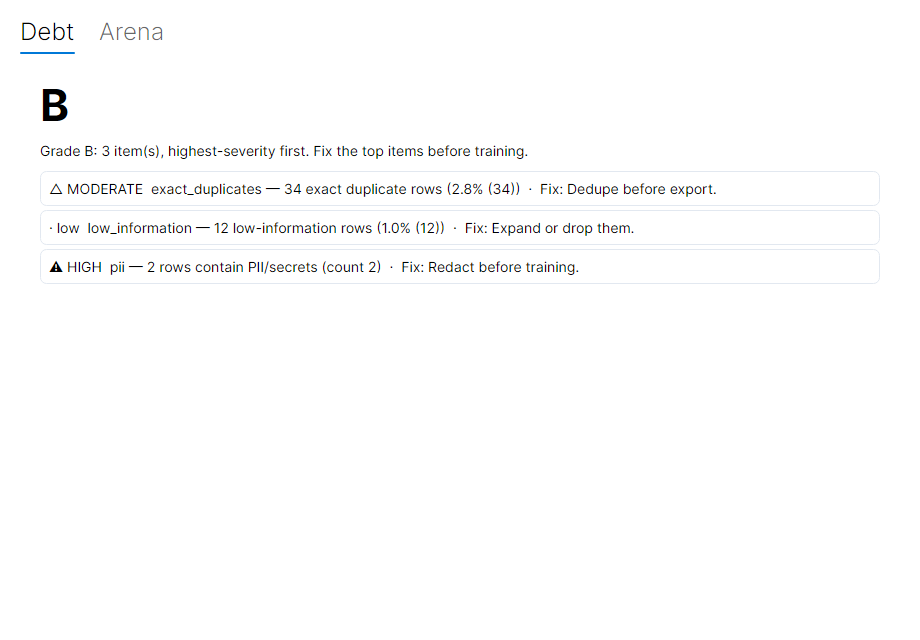

# Avalonia Migration — Execution Plan

**Companion to [`CROSS_PLATFORM_ASSESSMENT.md`](CROSS_PLATFORM_ASSESSMENT.md).** The assessment
answers *whether/why* (yes, eventually; Avalonia; decompose first). This document is the *how* — a
concrete, phased, slice-by-slice plan grounded in the current decomposition state.

## Progress

- **Phase 0 — DONE.** Cross-platform venv-path fix (`PythonExecutableResolver`) + the platform-seam
  shims behind interfaces: `IDialogService` (WPF `MessageBoxDialogService`) and `IFilePickerService`
  (WPF `Win32FilePickerService`), DI-registered, all dialogs/pickers routed through them.
- **Phase 1 — foundation + spike DONE.** Extracted a shared **`CorpusStudio.Core`** (`net8.0`) with
  all Models + view-models + the WPF-free services + seam interfaces (the WPF head keeps Views/`App`
  + the two WPF adapters and references Core). Then the **spike passed (GO):** a `CorpusStudio.Avalonia`
  (`net8.0`) head builds the **Debt + Arena** tabs in `.axaml` over the *unchanged* view-models —
  compiled bindings validate at build time (same DI as WPF; `IsVisible`←`bool`; TwoWay text; list
  templating), so a green build is the proof. Not shipped; WPF remains the product head.
- **Phase 2 — next.** Decompose the remaining 13 tabs out of `MainWindowViewModel` and port each view.

The spike, running: an **Avalonia** head rendering the **Debt** (and Arena) tab over the *unchanged*
`DebtViewModel` from `CorpusStudio.Core` — same view-models, same DI, cross-platform toolkit.

Ground-truth measured 2026-07-05:

| Fact | Value |
|---|---|
| Studio tabs | **15** (Dashboard, Writing Studio, Examples, Preference Review, Quarantine, Splits, Evaluation, AI Assist, Training, Arena, Artifacts, Suites, Versions, Debt, Settings) |
| Per-tab VMs extracted | **2** — Debt, Arena (each `IXxxViewModel` + `XxxViewModel : ViewModelBase`), and both only *partially* (e.g. `DebtTrend` still lives in the god object) |
| `MainWindowViewModel.cs` | **5,609 lines** (the god object) |
| Code-behind `_Click` handlers | **108**, `ICommand` count: **0** |
| DI | `App.xaml.cs` → `ServiceCollection` → `AddTransient<IDebtViewModel,…>` / `<IArenaViewModel,…>` / `<MainWindowViewModel>`; ctor injection with a parameterless design-time/test ctor |
| WPF-only surface (from the assessment) | 3,378 XAML lines · 40 Triggers · 93 `Visibility` bindings · 42 ControlTemplates · 35 `MessageBox.Show` · 4 file dialogs |
| Already portable | engine bridge (`Process`), 68 `.cs` in Models/Services/VMs, 0 `DllImport`, 0 third-party UI pkgs, the whole test suite |

## Critique (read before committing)

**The riskiest assumption is not "can we decompose" — it's "will Avalonia actually reuse these
VMs cleanly."** The decomposition pattern is already proven (Debt + Arena behind interfaces, DI,
`ViewModelBase`, a parameterless test ctor keeping `new MainWindowViewModel()` alive). What is
*unproven* is that an Avalonia head can bind to those exact VMs and that the platform seams
(dialogs, file pickers, Triggers→selectors, the venv path) shim cleanly. The assessment's own
recommendation — decompose all 13 remaining tabs *first*, then port — front-loads **weeks** of work
before that assumption is tested. That's the wrong risk order.

**Recommended inversion: prove the port on the 2 tabs already extracted, before decomposing the
other 13.** A throwaway-friendly Avalonia spike (shell + Debt + Arena over the *unchanged* VMs)
costs days, not weeks, and answers the real question. If it works, the remaining decomposition
becomes de-risked grunt work with a clear target shape. If it surfaces a blocker (a VM leaking WPF
types, a binding Avalonia can't express), we learn it for the price of 2 tabs, not 15.

**Honest caveats:**
- Even the "done" tabs aren't fully extracted — `MainWindowViewModel` still holds `DebtTrend` and
  a lot of Debt/Arena-adjacent state. "2/15" overstates progress; call it ~1.5/15.
- The 5,609-line god object is the cost center, and it **grew** during v1.2/v1.3 (was ~5,549).
  Every feature added without extraction makes the port more expensive — there's a carrying cost
  to *not* deciding.
- This is a genuine **multi-week** effort with a **dual-maintenance window**. It should not start
  unless cross-platform is a real product goal (users on macOS/Linux who want to drive local
  training there). If it's speculative, the decomposition is *still* worth doing for
  maintainability — but the Avalonia head is not.

## Phased plan

Each phase is independently valuable and shippable. WPF keeps shipping throughout.

### Phase 0 — Platform-seam shims + the venv fix (small; valuable even without a port)
Make the seams injectable so both heads can share VMs later, and fix the one real
cross-platform bug now.
- **`IDialogService`** (`ConfirmAsync` / `MessageAsync`) — route the 35 `MessageBox.Show` calls
  through it. WPF impl wraps `MessageBox`; Avalonia impl comes later. (The unsaved-work guard from
  Tier-A #134 is already a step toward this — one confirm chokepoint.)
- **`IFilePickerService`** — wrap the 4 `OpenFolderDialog`/`OpenFileDialog` sites.
- **Fix `ResolvePythonExecutable`** (`PythonEngineService.cs`): it hardcodes `.venv/Scripts/python.exe`
  (Windows). Add a POSIX branch (`.venv/bin/python`) so a macOS/Linux venv isn't silently bypassed.
  This is a real bug independent of the port — do it regardless.
- *Effort:* ~1–2 slices. *Ships on WPF; no behavior change.*

### Phase 1 — Avalonia proof spike (the GO/NO-GO gate)
A new `apps/desktop/CorpusStudio.Avalonia` project in the solution that **references the existing
Models/Services/VMs unchanged** and re-authors **only the shell + the Debt and Arena tabs** as
`.axaml`.
- Validates: VMs reused verbatim; `Trigger`→style selectors/pseudo-classes; `Visibility`→`IsVisible`;
  one `MessageBox`→`IDialogService`; `StorageProvider` file picker; the DI bootstrap on Avalonia.
- **Explicitly a spike** — throwaway-friendly, not parity. Its output is a **decision**: the
  shared-VM approach holds (proceed) or it doesn't (stop / rethink).
- *Effort:* days. *Does not ship; lives behind the WPF head.*

### Phase 2 — Finish the decomposition (the gating grunt work)
Extract the remaining ~13 tabs' logic out of `MainWindowViewModel` into per-tab VMs behind
interfaces, following the proven Debt/Arena pattern, one shippable slice per tab. Sequence
**simplest/most-isolated first** to build momentum and keep each slice low-risk:
1. **Settings, Versions, Suites, Artifacts** — mostly read/act over existing services; small state.
2. **Splits, Preference Review, Quarantine, Examples** — moderate; some editor state.
3. **Dashboard, Writing Studio** — bind-heavy but logic-light.
4. **Evaluation, Training, AI Assist** — the big, coupled ones; do them last with the pattern
   fully grooved. (Also finish extracting Debt/Arena's residual state.)
- Each slice: `IXxxViewModel` + `XxxViewModel : ViewModelBase` + DI registration + move the
  code-behind handlers to VM methods/commands + tests. The existing 414-test desktop suite guards
  every move; add per-VM tests as logic lands in a testable seam.
- *Effort:* the bulk — multiple weeks, but each tab is a clean, independently-reviewable PR.

### Phase 3 — Port tabs to Avalonia incrementally
As each tab's VM is extracted (Phase 2), re-author its view as `.axaml` in the Avalonia head,
converting Triggers→selectors and Visibility→`IsVisible` per view. Dual-head until parity.
- *Effort:* proportional to XAML per tab; overlaps Phase 2.

### Phase 4 — Per-OS engine + packaging story
The engine stays a runtime prerequisite (unchanged hard boundary). Decide the macOS/Linux
setup/packaging story (the "engine not found" setup screen already guides this). Orthogonal to the
UI port.

## Recommended first concrete slice

**Phase 0's `IDialogService` + the venv-path fix**, as one small PR — it's the lowest-risk, highest-
leverage starting point: it's useful on WPF today, it fixes a real cross-platform bug, and it
removes the single most-duplicated platform seam (35 `MessageBox.Show`) before the spike needs it.
Then **Phase 1 (the Avalonia spike)** as the very next step to hit the GO/NO-GO gate cheaply.

## Risks & non-goals
- **Not a mechanical XAML rename** — Triggers→selectors + Visibility→`IsVisible` are conceptual,
  spread across ~130 sites. Budget for them.
- **Dual-maintenance window** while both heads exist — mitigated by all logic in shared VMs.
- **Carrying cost** — every new feature added to the god object before Phase 2 makes the port dearer.
- **Non-goal:** bundling Python/CUDA/a GPU stack (unchanged). This is a *UI* port.
- **Non-goal:** a big-bang rewrite. Every phase ships; WPF never stops working.

## Acceptance criteria per phase
- **P0:** all 35 `MessageBox`/4 file-dialog sites route through the services; `ResolvePythonExecutable`
  resolves a POSIX venv; desktop tests green; WPF behavior unchanged.
- **P1:** the Avalonia head launches, shows the shell + Debt + Arena tabs bound to the *unchanged*
  VMs, over the real engine; a written GO/NO-GO with any surfaced blockers.
- **P2 (per tab):** the tab's logic lives in `IXxxViewModel`/`XxxViewModel` with tests; the god
  object shrinks by that tab; WPF still green.
- **P3 (per tab):** the tab renders + works in the Avalonia head at parity with WPF.
