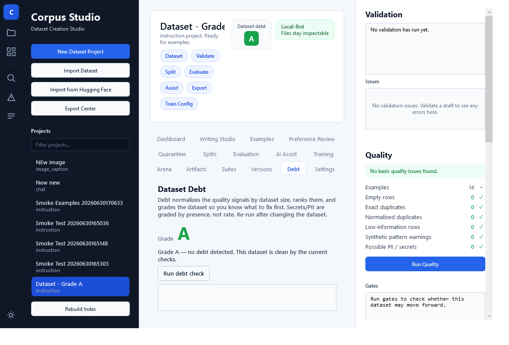
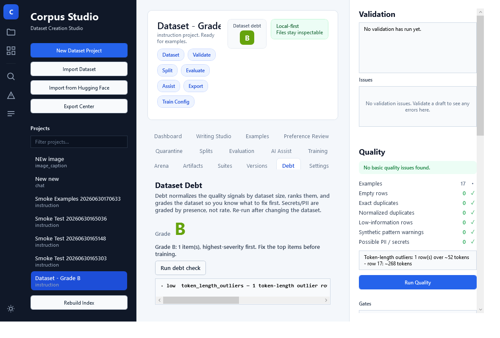
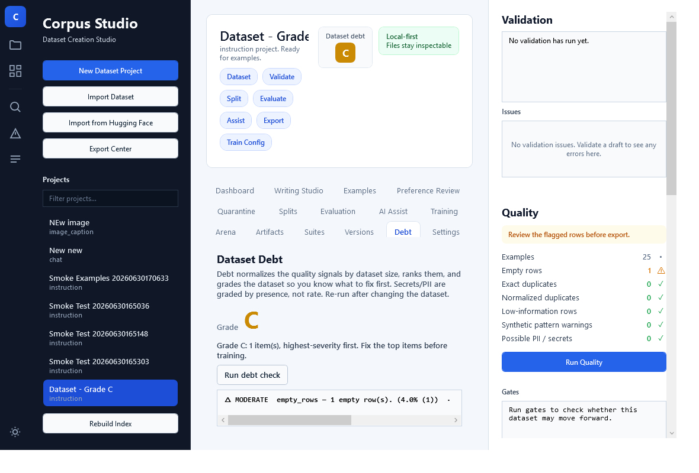
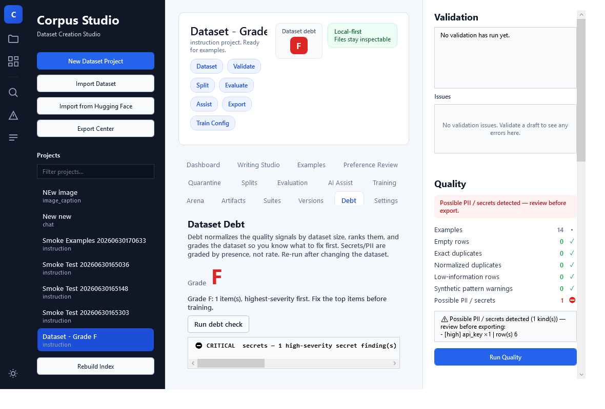

# Dataset Debt (v1.1)

**Dataset debt** is the inventory of outstanding quality problems in a dataset —
the things you should *pay down* before training. The debt ledger reuses the
existing quality report (it adds **no** new detection) and reframes it to answer
one question the raw numbers don't: **"is this dataset train-ready, and if not,
what do I fix first?"**

## Debt vs quality vs gates

| | Answers | Shape |
|---|---|---|
| **Quality report** | "what did we detect?" | a flat bag of raw counts |
| **Gates** | "may this move forward *now*?" | pass / warn / block at a threshold |
| **Debt** | "how bad is it, and what do I fix first?" | a **normalized, ranked, graded ledger** with remediation |

The value debt adds over the quality report is exactly three things:

1. **Normalization** — counts become *rates* per dataset size. "8 duplicates" is a
   crisis in 20 rows (40%) and noise in 100k (0.008%). Rates make the numbers
   interpretable.
2. **Prioritization** — items are ranked by severity, so there is a clear #1 fix.
3. **One honest grade** — a single A–F health signal, plus a concrete paydown
   action per item.

## The ledger

`build_debt_report(quality_report)` (pure) emits a `DebtReport`:

- `grade` - **A–F**, or **`null`** when no grade can honestly be given.
- `grade_reason` - why the grade is withheld; `""` exactly when a grade was given.
- `items` — a list of `DebtItem{category, severity, count, rate, message,
  remediation}`, **highest severity first**.
- `not_assessed` - the signals this dataset's shape does not support, so they ran no
  check at all. Their absence from `items` is "not measured", never "measured clean".
- `.clean` - true only when there are rows, a grade was given, and there is no debt.
- `.graded` - whether a letter was given at all.

### Severity rules (documented, per category)

Severity is **coarse and rule-based**, never a fake-precise score.

| Category | Rule |
|---|---|
| `empty_rows`, `low_information` | rate > 0.10 → high, > 0.02 → moderate, > 0 → low |
| `exact_duplicates`, `normalized_duplicates` | rate > 0.05 → high, > 0.01 → moderate, > 0 → low |
| `secrets` (high-severity PII: keys/tokens/JWTs) | **present → critical** |
| `personal_data` (medium PII: emails/SSNs) | **present → high** |
| `synthetic_patterns` | max issue severity: high→high, medium→moderate, low→low |
| `token_length_outliers` (advisory) | rate > 0.10 → moderate, > 0 → low (capped) |
| `category_imbalance` (worst field's dominant share) | share > 0.90 → high, > 0.75 → moderate, > 0.50 → low |

> **Secrets/PII are graded by PRESENCE, never by rate.** A single leaked API key
> is `critical` no matter how large the dataset — normalizing a credential away by
> rate would be exactly the wrong call. `rate` is `null` for these (and for
> imbalance, which uses share).

### Grade rule

**F** if any item is critical; else **D** if any high; else **C** if any moderate;
else **B** if any low; else **A** (rows present, no debt).

### When the grade is WITHHELD

A letter is a claim the ledger has to stand behind, so it is withheld (`grade: null`, with
`grade_reason` saying which case) rather than guessed in three situations:

| Case | Why |
|---|---|
| **0 rows** | nothing to assess. An empty dataset is not grade A. |
| **the shape does not support the text signals** | the quality signals are TEXT signals. On an object-detection corpus of normalized boxes, or a numeric table, they read nothing, so an A would mean "clean" and a D "broken" on the strength of heuristics that never ran. The signals are named in `not_assessed`, and contribute no items. Needs `--schema`. |
| **no debt found, and the applicability was never measured** | finding nothing is not the same as finding nothing wrong. A clean bill of health is a positive claim, and without a schema it is not known whether the signals could read the data at all. Items that DID fire are their own evidence, so an unmeasured B/C/D/F still stands. |

Applicability comes from the schema's declared `FieldType`: `text` / `markdown` / `code` /
`messages` are prose, `string` is a short scalar (an id, a label, a hash, a URL, an enum
member). It is never guessed from the values, because a license statement and a URL tokenize
like a short sentence while a caption can be shorter than both. The applicable coverage is the
**measured** share of the dataset's tokens living in prose fields, not a field count: `raw_text`
declares one prose field among five and `image_caption` one among four, yet the text carries
nearly all of the content. See `corpus_studio/quality/applicability.py`.

### The grades in the desktop Debt tab

Each grade below is a **genuine** verdict the engine produced on a real dataset — the badge,
the ledger, and the Quality panel all reflect the actual analysis, not a mock-up.

| Grade | What triggered it |
|---|---|
|  | **A** — a clean dataset: no debt items. |
|  | **B** — one low-severity signal (a token-length outlier). |
|  | **C** — an empty row at a moderate rate (4%). |
|  | **D** — leaked **personal data** (an email address). |
|  | **F** — a leaked **secret** (an API key) — presence-graded, always critical. |

The grade invalidates the moment the dataset changes, so it never shows a stale verdict.

## Command

```
# Prioritized, graded debt ledger (Markdown, or --json for the DebtReport)
python -m corpus_studio.cli dataset-debt <examples.jsonl> [--json]

# Assess which signals this dataset's SHAPE supports before grading it. Without --schema the
# applicability is unmeasured, and a run that finds no debt withholds the grade.
python -m corpus_studio.cli dataset-debt <examples.jsonl> --schema <schema_id> \
    [--project-dir <project>] [--json]

# The same applicability block on the raw quality report
python -m corpus_studio.cli quality <examples.jsonl> --schema <schema_id> [--project-dir <project>]
```

## Implemented vs deferred

**Implemented (v1.1, engine):** `reporting/debt_report.py` (`DebtItem`,
`DebtReport`, `build_debt_report`, `render_debt_report_markdown`) and the
`dataset-debt` CLI, reusing `build_basic_quality_report`.

**Implemented (v1.1, desktop):** a **Debt** tab with a prominent color-coded grade
(F/critical red; N/A neutral gray — never green), a "Run debt check" button, and
the ranked, severity-badged remediation ledger. Everything goes through the engine;
the desktop only parses and colors. The grade **invalidates the moment the dataset
changes** (any edit/import/restore) and is cleared on project switch, so it can
never show a stale verdict.

**Deferred:** a Dashboard grade badge (auto-run on open); **trend over time**
(is debt growing or shrinking, via quality history); folding gate results into the
ledger; remediation *actions* (the ledger recommends fixes, it does not apply
them); and any opaque numeric score (a grade is deliberately used instead).
